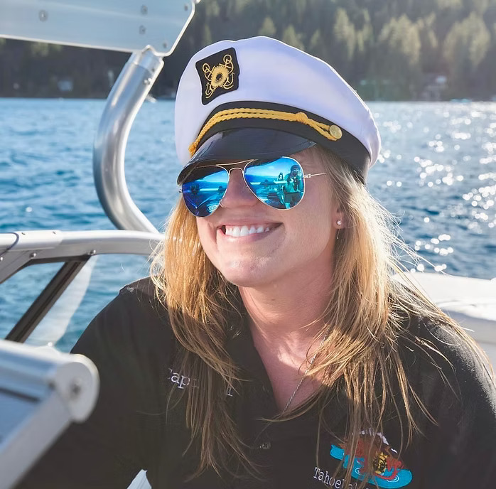

# SHARED PARTIALS REFERENCE
# Copy these snippets into each page — search/replace <!--ACTIVE_PAGE--> with the current page filename.

## HEAD block (paste inside <head>)
```
<meta charset="UTF-8">
<meta name="viewport" content="width=device-width, initial-scale=1.0">
<link rel="preconnect" href="https://fonts.googleapis.com">
<link href="https://fonts.googleapis.com/css2?family=Cormorant+Garamond:ital,wght@0,300;0,400;0,500;1,300;1,400&family=DM+Sans:wght@300;400;500&display=swap" rel="stylesheet">
<link rel="stylesheet" href="css/styles.css">
```

## NAV — set the correct data-page on <nav> so JS can highlight the active link.
## FOOTER — paste identically into every page.

## Images
Place all images in the /images/ folder and reference them like:
  background-image: url('images/hero-home.jpg')
  

## Suggested image filenames:
  hero-home.jpg
  hero-keywest.jpg
  hero-yacht.jpg
  hero-instay.jpg
  hero-tahoe.jpg
  hero-winter.jpg
  hero-sf.jpg
  hero-crew.jpg
  hero-contact.jpg
  feature-why-twt.jpg
  feature-keywest-addons.jpg
  feature-tahoe-intro.jpg
  feature-tahoe-winter.jpg
  winter-boat.jpg
  winter-holiday.jpg
  winter-shuttle.jpg
  winter-snowshoe.jpg
